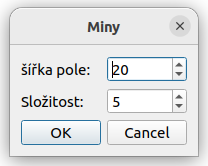
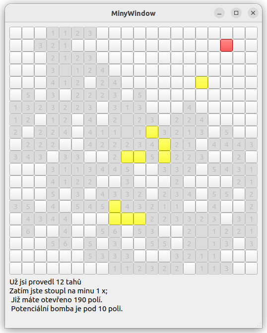
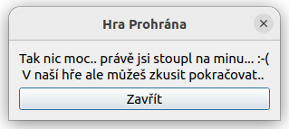

# Hra miny

Tento projekt je inspirován populární logickou hrou [Hledání min](https://cs.wikipedia.org/wiki/Hled%C3%A1n%C3%AD_min). Cílem nebylo vytvořit přesnou kopii ale vytvořit její variaci. Projekt je implementován v C++ s použitím grafického frameworku QT, což umožňuje interaktivní a vizuálně přívětivé rozhraní.


## Popis hry
Hra začíná vytvořením hracího pole s určitými rozměry, kde jsou miny rozmístěny podle zvolené úrovně obtížnosti. Rozměry herního pole a složitost je zadaná uživatelem při spuštění hry v dialogovém okně.



Během hry hráč kliká na dlaždice na hracím poli. Kliknutím na prázdnou dlaždici se tato otevře, a pokud sousední dlaždice neobsahují minu, automaticky se otevřou i ony. Na dlaždicích vedle min se zobrazí číslo udávající počet min v okolí, přičemž za sousední dlaždice se považují i ty v úhlopříčném směru.

Prohledávání bezpečných dlaždic se však omezuje pouze na ty, které sousedí s již otevřenou dlaždicí celou svou hranou, nikoli pouze vrcholem.

Hráč může pomocí kombinace kláves ctrl a kliknutí na dlaždici označit dlaždici, u které předpokládá minu. Takto označená dlaždice se obarví žlutě.



Pokud hráč klikne na dlaždici s minou, objeví se varovné upozornění a tato akce se zaznamená jako chybný tah.




## Popis řešení 
Pro řešení hry je využit grafický framework QT, který mimo samotných grafických komponent poskytuje další nástroje. Z QT frameworku byly dále využity například signály a konektory, běhové prostředí a atributy u QT widgetů byly využity pro předávání informací o stavu hry. Dále se využívají QTDialogy pro vstupní nastavovací menu a pro hlášku se šlápnutím na minu. 


### Grafické rozhraní

Využívám QT widgety pro vytvoření přehledného a uživatelsky přívětivého rozhraní. To zahrnuje tlačítka pro ovládání hry, dialogová okna pro nastavení a informování hráčů o průběhu hry.


### Herní logika

Herní pole je generováno s náhodným rozložením min. Počet min v okolí "otevřených" polí je počítán v reálném čase po jejich otevření. Bylo by možné tyto hodnoty mít napočítané dopředu. Vzhledem k dnešnímu velmi vysokému výkonu to není potřeba řešit tímto způsobem. Implementoval jsem logiku pro odhalování sousedních políček a detekci konce hry, když hráč klikne na minu. 


### Interakce a funkce

Hra využívá QT signály a sloty pro efektivní reakci na uživatelské akce, jako je kliknutí na políčko nebo volba nastavení hry. Kód je navržen s důrazem na čitelnost, což usnadňuje jeho možné rozšíření.


## Kompilace

Program byl vyjíjen na linuxu (ubuntu 22.04). Předpokládá se nainstalovaný QT6 framework `sudo apt install qt6-base-dev`. 

Následně je potřeba spustit `cmake .` a `make` příkazy ve složce se zdrojovými kódy.

Výstup by měl vypadat přibližně následovně: 

```bash
 $ cmake .
-- The CXX compiler identification is GNU 11.4.0
-- Detecting CXX compiler ABI info
-- Detecting CXX compiler ABI info - done
-- Check for working CXX compiler: /usr/bin/c++ - skipped
-- Detecting CXX compile features
-- Detecting CXX compile features - done
-- Performing Test CMAKE_HAVE_LIBC_PTHREAD
-- Performing Test CMAKE_HAVE_LIBC_PTHREAD - Success
-- Found Threads: TRUE  
-- Performing Test HAVE_STDATOMIC
-- Performing Test HAVE_STDATOMIC - Success
-- Found WrapAtomic: TRUE  
-- Found OpenGL: /usr/lib/x86_64-linux-gnu/libOpenGL.so   
-- Found WrapOpenGL: TRUE  
-- Found XKB: /usr/lib/x86_64-linux-gnu/libxkbcommon.so (found suitable version "1.4.0", minimum required is "0.5.0") 
-- Found WrapVulkanHeaders: /usr/include  
-- Configuring done
-- Generating done
-- Build files have been written to: /home/****/Miny


 $ make 
[ 20%] Automatic MOC and UIC for target Miny
[ 20%] Built target Miny_autogen
[ 40%] Building CXX object CMakeFiles/Miny.dir/Miny_autogen/mocs_compilation.cpp.o
[ 60%] Building CXX object CMakeFiles/Miny.dir/main.cpp.o
[ 80%] Building CXX object CMakeFiles/Miny.dir/minywindow.cpp.o
[100%] Linking CXX executable Miny
[100%] Built target Miny

```

Nyní ve stejné složce bychom měli mít spustitelný soubor `Miny`. 

Hru nyní spustíme přikazem `./Miny`.

> Repozitář obsahuje binárku `Miny`, která byla zkompilovaná pro linux, x86_64. 


